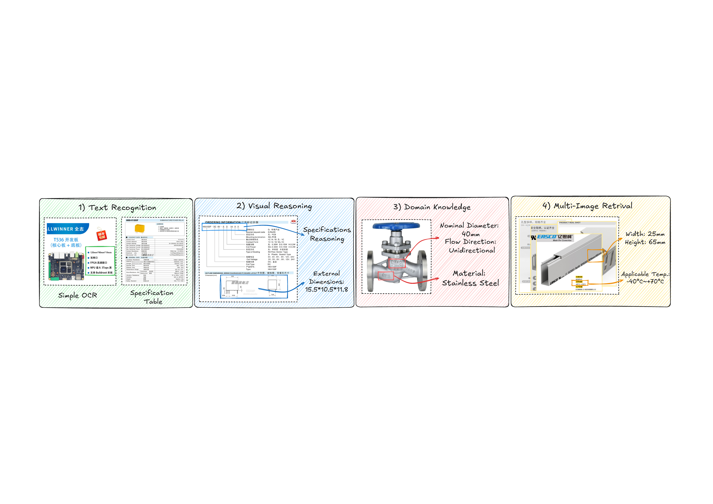
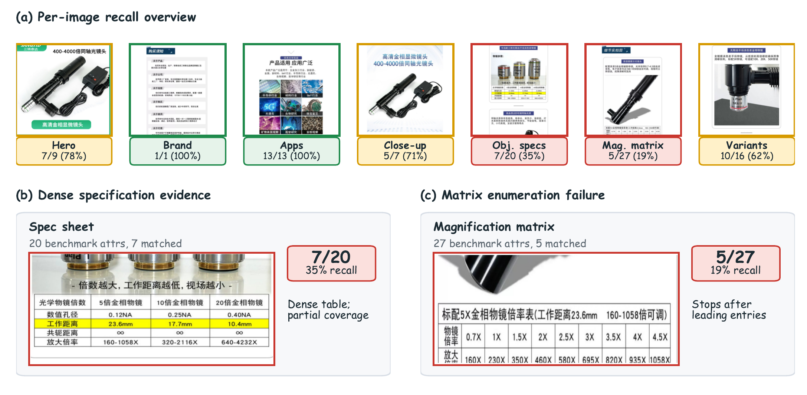
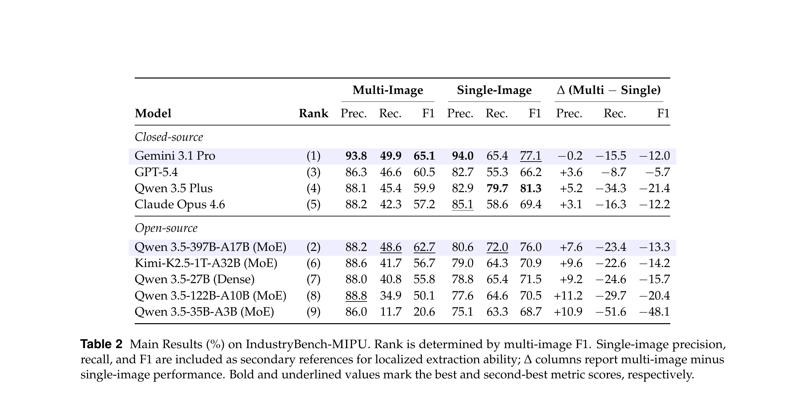
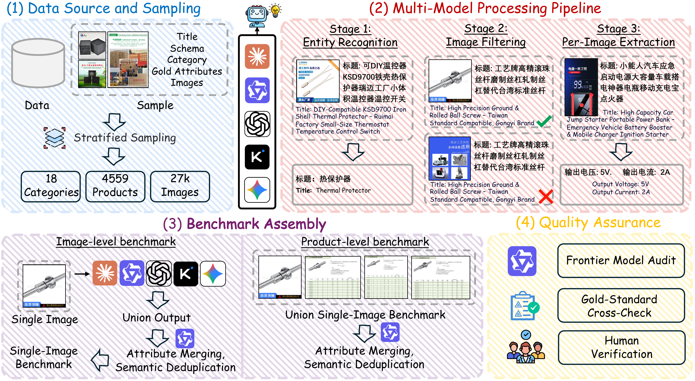

# IndustryBench-MIPU

[](https://arxiv.org/abs/2606.14383)
[](https://huggingface.co/datasets/alibaba-multimodal-industrial-ai/IndustryBench-MIPU)

**Multi-Image Industrial Product Understanding Benchmark** — evaluating MLLMs on structured attribute extraction from industrial product images.

<p align="center">
  
</p>

Industrial product specifications are scattered across multiple heterogeneous images — specification tables, nameplates, technical drawings. **IndustryBench-MIPU** tests whether MLLMs can reliably recover them through four challenges: text recognition, visual reasoning, domain knowledge, and cross-image evidence integration.

---

## Dataset Overview

| Statistic | Value |
|-----------|-------|
| Products | 4,559 |
| Valid images | 27,652 |
| Top-level categories | 18 |
| Unique property names | 3,564 |
| Image-level annotations | 182,527 |
| Product-level annotations | 103,703 |

Two evaluation granularities:
- **Single-image** (`single_image_level.jsonl`) — extract attributes visible in one image
- **Multi-image** (`multi_image_level.jsonl`) — extract all attributes from a product's full image set

---

## Task Definition

**Input**: Product images + product-specific attribute schema (list of valid property names)

**Output**: Structured property-value pairs extracted from visual evidence

<p align="center">
  
</p>

> **Case Study**: A microscope objective with 7 images and 69 benchmark attributes. The top model achieves 100% precision but only 45% recall — failures concentrate in dense specification tables where the model stops enumerating after 4–5 values.

---

## Quick Start

```bash
# 1. Clone data from HuggingFace
git lfs install
git clone https://huggingface.co/datasets/alibaba-multimodal-industrial-ai/IndustryBench-MIPU

# 2. Install
pip install -r code/requirements.txt
export API_KEY="your-api-key"
export API_BASE_URL="https://your-api-endpoint"

# 3. Run evaluation (Extract → Eval → Aggregate)
cd code
python run_multi_extract.py \
    --input ../data/multi_image_level.jsonl \
    --output results/extract.jsonl \
    --provider openai --model qwen-plus \
    --api-key $API_KEY --api-base $API_BASE_URL \
    --workers 10 --request-workers 30 --retry 3 --shuffle

python run_eval.py \
    --input results/extract.jsonl \
    --output results/eval.jsonl \
    --provider openai --model qwen-plus \
    --api-key $API_KEY --api-base $API_BASE_URL \
    --workers 20 --request-workers 60 --retry 3

python aggregate_eval.py \
    --input results/eval.jsonl \
    --bench ../data/multi_image_level.jsonl \
    --extract results/extract.jsonl
```

---

## Data Format

### Multi-Image Level (`multi_image_level.jsonl`)

```json
{
  "item_id": "560324848370",
  "title": "日亚铝基板 NICHIA ...",
  "cate1_name": "电子元器件",
  "main_entity": "NICHIA铝基板",
  "cpv_schema": "颜色,品牌,型号,...",
  "images": [{"image_path": "images/560324848370_main_0.jpg", ...}],
  "cpv_results": [{"property_name": "颜色", "property_value": "白色"}, ...]
}
```

### Single-Image Level (`single_image_level.jsonl`)

```json
{
  "record_id": "589158697373#detail_3",
  "image_path": "images/589158697373_detail_3.jpg",
  "cpv_results": [{"property_name": "含量", "property_value": "98%"}]
}
```

---

## Evaluation Pipeline

**Extract** → Send product images + metadata to an MLLM, get `{property_name, property_value}` pairs

**Eval** → Cascaded matching: rule-based normalization first, LLM semantic judge for ambiguous cases

**Aggregate** → Precision (correct / predicted), Recall (matched / benchmark), F1

### Supported Providers

| Provider | `--provider` | Notes |
|----------|-------------|-------|
| OpenAI-compatible | `openai` | Qwen, Gemini, vLLM, etc. |
| Anthropic | `anthropic` | Claude, supports `--enable-thinking` |

---

## Main Results

<p align="center">
  
</p>

The dominant pattern: high precision (86–94%) but low recall — the best model recovers only half the product-level attributes.

---

## Construction Pipeline

<p align="center">
  
</p>

---

## Citation

<details>
<summary>BibTeX</summary>

```bibtex
@article{industrybench-mipu,
  title={IndustryBench-MIPU: Benchmarking Multi-Image Attribute Value Extraction for Industrial Products},
  author={Multimodal and Industrial AI Team, Alibaba},
  journal={arXiv preprint arXiv:2606.14383},
  year={2026},
  url={https://arxiv.org/abs/2606.14383}
}
```

</details>
